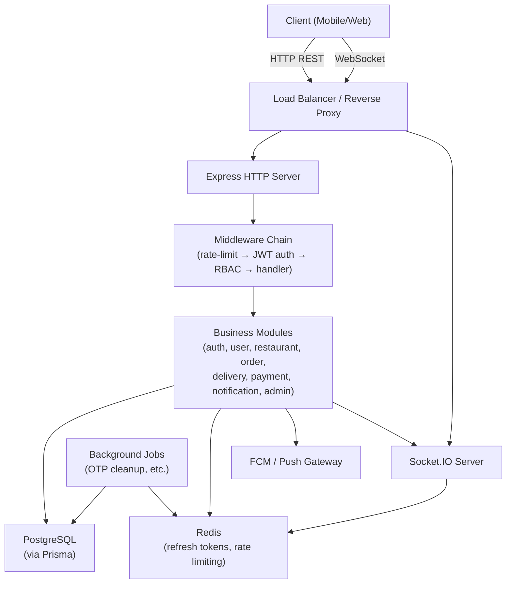

# Design Document: Food Delivery Backend

## Overview

This document describes the technical design for a full-featured Node.js backend powering a food delivery platform. The system serves four distinct user roles — customers, restaurant owners, delivery agents, and admins — each with scoped access enforced from the moment of authentication.

The backend is built on Express.js with a modular architecture under `src/modules/`, where each module encapsulates its own routes, controller, service, and validation logic. PostgreSQL is the primary data store accessed via Prisma ORM. Redis handles refresh token storage and rate limiting. Socket.IO provides real-time bidirectional communication for order and delivery events. Background jobs handle housekeeping tasks like OTP expiry cleanup.

The system exposes a RESTful HTTP API with a consistent response envelope and a Socket.IO server secured by JWT authentication.

---

## Architecture

### High-Level Architecture



### Folder Structure

```
food-delivery-backend/
├── server.js                        # Entry point: boots Express + Socket.IO
├── ARCHITECTURE.md                  # Folder-level documentation
├── src/
│   ├── config/
│   │   ├── db.js                    # Prisma client singleton
│   │   ├── redis.js                 # Redis client singleton
│   │   └── env.js                   # Validated env vars (dotenv + joi)
│   ├── common/
│   │   ├── middleware/
│   │   │   ├── authenticate.js      # JWT verification middleware
│   │   │   ├── authorize.js         # RBAC role-guard middleware
│   │   │   ├── errorHandler.js      # Global error handler
│   │   │   ├── rateLimiter.js       # Redis-backed rate limiter
│   │   │   └── validate.js          # Joi/Zod request validation wrapper
│   │   ├── utils/
│   │   │   ├── response.js          # success() / error() response helpers
│   │   │   ├── jwt.js               # signToken / verifyToken helpers
│   │   │   ├── otp.js               # OTP generation and TTL helpers
│   │   │   └── logger.js            # Winston logger instance
│   │   └── constants/
│   │       ├── roles.js             # CUSTOMER, RESTAURANT_OWNER, DELIVERY, ADMIN
│   │       ├── orderStatus.js       # Order status enum values
│   │       └── paymentStatus.js     # Payment status enum values
│   ├── modules/
│   │   ├── auth/
│   │   │   ├── routes.js
│   │   │   ├── controller.js
│   │   │   ├── service.js
│   │   │   └── validation.js
│   │   ├── user/
│   │   │   ├── routes.js
│   │   │   ├── controller.js
│   │   │   ├── service.js
│   │   │   └── validation.js
│   │   ├── restaurant/
│   │   │   ├── routes.js
│   │   │   ├── controller.js
│   │   │   ├── service.js
│   │   │   └── validation.js
│   │   ├── order/
│   │   │   ├── routes.js
│   │   │   ├── controller.js
│   │   │   ├── service.js
│   │   │   └── validation.js
│   │   ├── delivery/
│   │   │   ├── routes.js
│   │   │   ├── controller.js
│   │   │   ├── service.js
│   │   │   └── validation.js
│   │   ├── payment/
│   │   │   ├── routes.js
│   │   │   ├── controller.js
│   │   │   ├── service.js
│   │   │   └── validation.js
│   │   ├── notification/
│   │   │   ├── routes.js
│   │   │   ├── controller.js
│   │   │   ├── service.js
│   │   │   └── validation.js
│   │   └── admin/
│   │       ├── routes.js
│   │       ├── controller.js
│   │       ├── service.js
│   │       └── validation.js
│   ├── sockets/
│   │   ├── index.js                 # Socket.IO server init + JWT auth middleware
│   │   ├── orderHandlers.js         # order_status_update, new_order events
│   │   └── deliveryHandlers.js      # delivery_location, new_delivery_request events
│   └── jobs/
│       ├── index.js                 # Job scheduler bootstrap
│       └── otpCleanup.js            # Periodic expired OTP record removal
└── prisma/
    └── schema.prisma                # Database schema
```

---

## Components and Interfaces

### Middleware Chain

Every protected HTTP request passes through this ordered chain:

```
Request
  → rateLimiter (auth endpoints only)
  → authenticate.js   (verifies JWT signature + expiry, attaches req.user)
  → authorize.js      (checks req.user.role against allowed roles for route)
  → validate.js       (validates req.body / req.params / req.query via schema)
  → Controller handler
  → errorHandler.js   (catches thrown errors, formats response envelope)
```

### Response Envelope

All responses use a consistent shape via `src/common/utils/response.js`:

```js
// Success
{ success: true, data: <payload> }

// Error
{ success: false, error: { code: "<ERROR_CODE>", message: "<human message>" } }
```

### JWT Structure

```js
// Access token payload
{ id, phone, role, iat, exp }  // exp = 15 minutes

// Refresh token: opaque UUID stored in Redis with key pattern:
// refresh:<userId>:<tokenId>  →  TTL 7 days
```

### Module Interface Pattern

Each module follows the same internal contract:

```
routes.js      → mounts Express Router, applies middleware, delegates to controller
controller.js  → extracts req data, calls service, sends response via response helpers
service.js     → contains all business logic, interacts with Prisma and Redis
validation.js  → exports Joi/Zod schemas for each endpoint's request shape
```

### Socket.IO Interface

```
Connection:   client sends JWT in handshake auth header
              → socket middleware verifies JWT
              → socket.data.userId and socket.data.role are set
              → socket joins room `user:<userId>`

Emitting:
  order_status_update  → io.to(`user:<customerId>`).emit(...)
  delivery_location    → io.to(`user:<customerId>`).emit(...)
  new_order            → io.to(`user:<restaurantOwnerId>`).emit(...)
  new_delivery_request → io.to('delivery_agents').emit(...)
                         (delivery agents join this room on connect)
```

### API Endpoints Summary

| Module | Method | Path | Roles |
|---|---|---|---|
| Auth | POST | /api/auth/register | public |
| Auth | POST | /api/auth/verify-otp | public |
| Auth | POST | /api/auth/login | public |
| Auth | POST | /api/auth/refresh | public |
| Auth | POST | /api/auth/logout | authenticated |
| User | GET | /api/users/me | authenticated |
| User | PATCH | /api/users/me | authenticated |
| User | POST | /api/users/addresses | customer |
| User | DELETE | /api/users/addresses/:id | customer |
| Restaurant | GET | /api/restaurants | public |
| Restaurant | GET | /api/restaurants/:id | public |
| Restaurant | POST | /api/restaurants/:id/menu | restaurant_owner |
| Restaurant | PATCH | /api/restaurants/:id/menu/:itemId | restaurant_owner |
| Order | POST | /api/orders | customer |
| Order | GET | /api/orders | customer |
| Order | POST | /api/orders/:id/cancel | customer |
| Order | PATCH | /api/orders/:id/status | restaurant_owner, delivery |
| Delivery | POST | /api/delivery/:orderId/accept | delivery |
| Delivery | POST | /api/delivery/:orderId/location | delivery |
| Delivery | POST | /api/delivery/:orderId/complete | delivery |
| Payment | POST | /api/payments | customer |
| Payment | POST | /api/payments/verify | customer |
| Payment | POST | /api/payments/:id/refund | customer |
| Notification | GET | /api/notifications | authenticated |
| Admin | POST | /api/admin/restaurants/:id/approve | admin |
| Admin | POST | /api/admin/agents/:id/approve | admin |
| Admin | GET | /api/admin/analytics | admin |

---

## Data Models

### Prisma Schema

```prisma
// prisma/schema.prisma

generator client {
  provider = "prisma-client-js"
}

datasource db {
  provider = "postgresql"
  url      = env("DATABASE_URL")
}

enum Role {
  customer
  restaurant_owner
  delivery
  admin
}

enum OrderStatus {
  pending
  confirmed
  preparing
  out_for_delivery
  delivered
  cancelled
}

enum PaymentStatus {
  pending
  paid
  failed
  refunded
}

model User {
  id            Int            @id @default(autoincrement())
  name          String
  phone         String         @unique
  password      String         // bcrypt hash
  role          Role
  is_verified   Boolean        @default(false)
  status        String         @default("active")
  created_at    DateTime       @default(now())
  updated_at    DateTime       @updatedAt

  addresses     Address[]
  restaurants   Restaurant[]
  orders        Order[]
  notifications Notification[]
  deliveries    DeliveryTracking[]
  otps          OTP[]
}

model OTP {
  id         Int      @id @default(autoincrement())
  user_id    Int
  code       String
  expires_at DateTime
  used       Boolean  @default(false)
  created_at DateTime @default(now())

  user       User     @relation(fields: [user_id], references: [id])
}

model Address {
  id         Int      @id @default(autoincrement())
  user_id    Int
  address    String
  lat        Float
  lng        Float
  created_at DateTime @default(now())

  user       User     @relation(fields: [user_id], references: [id])
  orders     Order[]
}

model Restaurant {
  id              Int        @id @default(autoincrement())
  owner_id        Int
  name            String
  description     String?
  rating          Float      @default(0)
  is_open         Boolean    @default(true)
  approval_status String     @default("pending") // pending | approved | rejected
  created_at      DateTime   @default(now())
  updated_at      DateTime   @updatedAt

  owner           User       @relation(fields: [owner_id], references: [id])
  menu_items      MenuItem[]
  orders          Order[]
}

model MenuItem {
  id            Int        @id @default(autoincrement())
  restaurant_id Int
  name          String
  price         Float
  category      String
  is_available  Boolean    @default(true)
  created_at    DateTime   @default(now())
  updated_at    DateTime   @updatedAt

  restaurant    Restaurant @relation(fields: [restaurant_id], references: [id])
  order_items   OrderItem[]
}

model Order {
  id             Int           @id @default(autoincrement())
  customer_id    Int
  restaurant_id  Int
  address_id     Int
  status         OrderStatus   @default(pending)
  payment_status PaymentStatus @default(pending)
  total          Float
  created_at     DateTime      @default(now())
  updated_at     DateTime      @updatedAt

  customer       User          @relation(fields: [customer_id], references: [id])
  restaurant     Restaurant    @relation(fields: [restaurant_id], references: [id])
  address        Address       @relation(fields: [address_id], references: [id])
  items          OrderItem[]
  payment        Payment?
  delivery       DeliveryTracking?
}

model OrderItem {
  id           Int      @id @default(autoincrement())
  order_id     Int
  menu_item_id Int
  quantity     Int
  unit_price   Float

  order        Order    @relation(fields: [order_id], references: [id])
  menu_item    MenuItem @relation(fields: [menu_item_id], references: [id])
}

model Payment {
  id         Int           @id @default(autoincrement())
  order_id   Int           @unique
  method     String
  status     PaymentStatus @default(pending)
  reference  String        @unique
  created_at DateTime      @default(now())
  updated_at DateTime      @updatedAt

  order      Order         @relation(fields: [order_id], references: [id])
}

model DeliveryTracking {
  id         Int      @id @default(autoincrement())
  order_id   Int      @unique
  agent_id   Int
  lat        Float?
  lng        Float?
  updated_at DateTime @updatedAt

  order      Order    @relation(fields: [order_id], references: [id])
  agent      User     @relation(fields: [agent_id], references: [id])
}

model Notification {
  id         Int      @id @default(autoincrement())
  user_id    Int
  message    String
  type       String
  is_read    Boolean  @default(false)
  created_at DateTime @default(now())

  user       User     @relation(fields: [user_id], references: [id])
}
```

### Redis Key Patterns

| Key Pattern | Value | TTL |
|---|---|---|
| `refresh:<userId>:<tokenId>` | `"valid"` | 7 days |
| `otp:<phone>` | `"<6-digit code>"` | 5 minutes |
| `rl:<ip>` | request count | 1 minute (rolling) |


---

## Correctness Properties

*A property is a characteristic or behavior that should hold true across all valid executions of a system — essentially, a formal statement about what the system should do. Properties serve as the bridge between human-readable specifications and machine-verifiable correctness guarantees.*

### Property 1: Registration creates unverified user

*For any* valid registration payload (name, phone, password, role), the resulting user record SHALL have `is_verified = false` and `status = active`.

**Validates: Requirements 1.1**

---

### Property 2: Duplicate phone rejected

*For any* phone number already registered in the system, a second registration attempt with that phone SHALL return a 409 error.

**Validates: Requirements 1.2**

---

### Property 3: OTP verification round-trip

*For any* user who registers and submits the correct OTP within 5 minutes, the user's `is_verified` field SHALL be set to `true`. Submitting an incorrect or expired OTP SHALL return a 400 error and leave `is_verified = false`.

**Validates: Requirements 1.3, 1.4, 1.5**

---

### Property 4: Unverified user blocked on protected endpoints

*For any* user with `is_verified = false` and *any* protected endpoint, the system SHALL return a 403 error before processing the request.

**Validates: Requirements 1.6**

---

### Property 5: Login JWT contains correct claims

*For any* valid login request (correct phone, password, and matching role), the returned JWT payload SHALL contain `id`, `phone`, and `role` claims that exactly match the stored user record.

**Validates: Requirements 2.1, 2.3, 12.1**

---

### Property 6: Role mismatch at login returns 403

*For any* login request where the provided role does not match the role stored on the user record, the system SHALL return a 403 error with the message "Role mismatch".

**Validates: Requirements 2.2**

---

### Property 7: Refresh token round-trip preserves role

*For any* user who logs in and receives a refresh token, submitting that refresh token SHALL return a new access token whose `role` claim is identical to the original token's `role` claim.

**Validates: Requirements 2.5**

---

### Property 8: Logout invalidates refresh token

*For any* user who logs in and then logs out, any subsequent refresh token request using the pre-logout refresh token SHALL return a 401 error.

**Validates: Requirements 2.6, 2.7**

---

### Property 9: Invalid JWT rejected on protected endpoints

*For any* protected endpoint, a request with a missing, expired, or tampered JWT SHALL be rejected before the handler executes.

**Validates: Requirements 2.8**

---

### Property 10: Profile round-trip

*For any* authenticated user, the fields returned by GET /users/me SHALL match the name, phone, role, and `is_verified` values stored in the database. After a valid PATCH /users/me, a subsequent GET SHALL reflect the updated values.

**Validates: Requirements 3.1, 3.2**

---

### Property 11: Address ownership isolation

*For any* address belonging to user A, a delete request from user B (where B ≠ A) SHALL return a 403 error and leave the address record unchanged.

**Validates: Requirements 3.4, 3.5**

---

### Property 12: Address add/delete round-trip

*For any* valid address payload submitted by an authenticated customer, the address SHALL appear in the user's address list. After deletion, the address SHALL no longer appear in the list.

**Validates: Requirements 3.3, 3.4**

---

### Property 13: Restaurant listing pagination invariants

*For any* page and limit parameters, the list-restaurants response SHALL contain at most `limit` items, each with `id`, `name`, `rating`, and `is_open` fields. Restaurants with `is_open = false` SHALL be included with `is_open = false`.

**Validates: Requirements 4.1, 4.4**

---

### Property 14: Restaurant details menu grouping

*For any* existing restaurant with menu items across multiple categories, the get-restaurant-details response SHALL include all menu items grouped by their category field.

**Validates: Requirements 4.2**

---

### Property 15: Menu item ownership enforcement

*For any* menu management request (add or update) from a user who does not own the target restaurant, the system SHALL return a 403 error and leave the menu unchanged.

**Validates: Requirements 5.3**

---

### Property 16: Menu item add/update round-trip

*For any* restaurant owner adding a menu item to their restaurant, the item SHALL appear in the restaurant's menu with the correct name, price, and category. After a valid update, the item SHALL reflect the updated fields.

**Validates: Requirements 5.1, 5.2**

---

### Property 17: Order creation sets initial state

*For any* valid create-order request (valid restaurant, valid item ids belonging to that restaurant, valid address), the created order SHALL have `status = pending`, `payment_status = pending`, and the response SHALL include the order id and computed total.

**Validates: Requirements 6.1**

---

### Property 18: Cross-restaurant item rejected

*For any* create-order request that references a menu item not belonging to the specified restaurant, the system SHALL return a 400 error and create no order record.

**Validates: Requirements 6.2**

---

### Property 19: Order cancellation state machine

*For any* order with `status = pending` or `status = confirmed`, a cancel request SHALL set `status = cancelled`. For any order with `status` in `{preparing, out_for_delivery, delivered}`, a cancel request SHALL return a 400 error and leave the status unchanged.

**Validates: Requirements 6.3, 6.4**

---

### Property 20: Order list isolation

*For any* authenticated customer, GET /orders SHALL return only orders belonging to that customer — no other customer's orders SHALL appear in the response.

**Validates: Requirements 6.5**

---

### Property 21: Order status update emits socket event

*For any* valid order status update by a restaurant owner or delivery agent, an `order_status_update` Socket.IO event SHALL be emitted to the room associated with the order's customer id.

**Validates: Requirements 6.6**

---

### Property 22: Delivery acceptance assigns agent

*For any* unassigned confirmed order and any available delivery agent, accepting the order SHALL assign the agent to the order and set `status = out_for_delivery`. A second accept request for the same order SHALL return a 409 error.

**Validates: Requirements 7.2, 7.3**

---

### Property 23: Location update persists and emits event

*For any* location update from the assigned delivery agent for an active order, the lat/lng SHALL be persisted in DeliveryTracking and a `delivery_location` Socket.IO event SHALL be emitted to the customer's room.

**Validates: Requirements 7.4**

---

### Property 24: Order completion round-trip

*For any* assigned order, the assigned agent completing it SHALL set `status = delivered` and emit an `order_status_update` event to the customer.

**Validates: Requirements 7.5**

---

### Property 25: Payment lifecycle round-trip

*For any* valid order, creating a payment SHALL produce a record with `status = pending` and a unique reference. Verifying with a successful gateway response SHALL set `status = paid` and `order.payment_status = paid`. Verifying with a failed response SHALL set `status = failed`.

**Validates: Requirements 8.1, 8.2, 8.3**

---

### Property 26: Refund eligibility enforcement

*For any* order with `payment_status = paid` and `status = cancelled`, a refund request SHALL set payment `status = refunded`. For any order without `payment_status = paid`, a refund request SHALL return a 400 error.

**Validates: Requirements 8.4, 8.5**

---

### Property 27: Notification creation and retrieval round-trip

*For any* event that triggers a notification, the stored notification record SHALL contain `user_id`, `message`, `type`, and `is_read = false`. GET /notifications for that user SHALL return the notification, and the list SHALL be ordered by `created_at` descending.

**Validates: Requirements 9.1, 9.3, 9.4**

---

### Property 28: Socket event room isolation

*For any* `order_status_update` or `delivery_location` event, the event SHALL be emitted only to the socket room of the relevant customer and SHALL NOT be received by sockets in other user rooms. For `new_order` events, the event SHALL reach only the relevant restaurant owner's room.

**Validates: Requirements 11.3, 11.4, 11.5**

---

### Property 29: Delivery agent broadcast

*For any* `new_delivery_request` event, the event SHALL be emitted to all sockets currently in the `delivery_agents` room.

**Validates: Requirements 7.1, 11.6, 9.2**

---

### Property 30: RBAC enforcement across all roles

*For any* role-restricted endpoint and *any* authenticated user whose JWT `role` claim does not match the required role for that endpoint, the system SHALL return a 403 error with a descriptive message before executing the handler.

**Validates: Requirements 12.3, 12.4, 12.5, 12.6, 12.7, 10.4**

---

### Property 31: Consistent response envelope

*For any* API call that succeeds, the response body SHALL match `{ success: true, data: <payload> }`. For any API call that results in an error, the response body SHALL match `{ success: false, error: { code: <string>, message: <string> } }`.

**Validates: Requirements 13.1, 13.2**

---

### Property 32: Validation failure returns 422 with field errors

*For any* request body that fails schema validation, the system SHALL return a 422 response whose error payload lists each invalid field and the reason for rejection.

**Validates: Requirements 13.4**

---

### Property 33: Auth endpoint rate limiting

*For any* IP address that sends more than 100 requests per minute to authentication endpoints, all requests beyond the limit SHALL be rejected (HTTP 429) until the window resets.

**Validates: Requirements 13.5**

---

### Property 34: Admin analytics correctness

*For any* specified date range with known seeded data, the analytics response SHALL return total orders, total revenue, active restaurants count, and active delivery agents count that exactly match the counts derivable from the database for that range.

**Validates: Requirements 10.3**

---

## Error Handling

### Error Classification

| HTTP Status | Error Code | Scenario |
|---|---|---|
| 400 | `BAD_REQUEST` | Invalid business logic (cancel non-cancellable order, cross-restaurant item) |
| 401 | `UNAUTHORIZED` | Missing/expired/invalid JWT, wrong credentials |
| 403 | `FORBIDDEN` | Unverified user, role mismatch, ownership violation |
| 404 | `NOT_FOUND` | Resource does not exist |
| 409 | `CONFLICT` | Duplicate phone, already-assigned delivery |
| 422 | `VALIDATION_ERROR` | Request body fails schema validation |
| 429 | `RATE_LIMITED` | Auth endpoint rate limit exceeded |
| 500 | `INTERNAL_ERROR` | Unhandled exception |

### Global Error Handler

`src/common/middleware/errorHandler.js` is registered as the last Express middleware. It:

1. Catches all errors thrown or passed via `next(err)` from any handler
2. Logs the full error with stack trace via Winston (never sent to client)
3. Maps known error types to their HTTP status codes
4. Returns the standard error envelope: `{ success: false, error: { code, message } }`
5. For unhandled/unknown errors, returns 500 with `INTERNAL_ERROR` code and a generic message

### Custom Error Class

```js
// src/common/utils/AppError.js
class AppError extends Error {
  constructor(statusCode, code, message) {
    super(message);
    this.statusCode = statusCode;
    this.code = code;
  }
}
```

All service-layer errors are thrown as `AppError` instances so the global handler can map them deterministically.

### Validation Errors

The `validate.js` middleware wraps Joi/Zod schema parsing. On failure it collects all field-level errors and throws an `AppError(422, 'VALIDATION_ERROR', ...)` with the field list included in the message payload.

---

## Testing Strategy

### Dual Testing Approach

The test suite uses both unit/integration tests and property-based tests. They are complementary:

- **Unit/integration tests** cover specific examples, integration points, and edge cases
- **Property-based tests** verify universal properties across randomly generated inputs

### Technology Choices

| Concern | Library |
|---|---|
| Test runner | Jest |
| Property-based testing | `fast-check` (JavaScript PBT library) |
| HTTP integration testing | `supertest` |
| Socket.IO testing | `socket.io-client` in test environment |
| Mocking | Jest mocks + `jest-mock-extended` |

### Unit / Integration Tests

Focus areas:
- Specific examples demonstrating correct behavior (e.g., a known valid login flow)
- Integration between controller → service → database (using a test PostgreSQL instance or in-memory SQLite via Prisma)
- Edge cases: expired OTP, non-existent resource ids, boundary status transitions
- Error conditions: wrong credentials, ownership violations, invalid JWT

Avoid writing unit tests for every line — property tests handle broad input coverage.

### Property-Based Tests

Each correctness property from the design document MUST be implemented as a single `fast-check` property test with a minimum of **100 iterations**.

Each test MUST include a comment tag in the format:
```
// Feature: food-delivery-backend, Property <N>: <property_text>
```

Example structure:

```js
import fc from 'fast-check';

// Feature: food-delivery-backend, Property 1: Registration creates unverified user
test('registration always creates unverified user', async () => {
  await fc.assert(
    fc.asyncProperty(
      fc.record({
        name: fc.string({ minLength: 1 }),
        phone: fc.string({ minLength: 10, maxLength: 15 }),
        password: fc.string({ minLength: 8 }),
        role: fc.constantFrom('customer', 'restaurant_owner', 'delivery'),
      }),
      async (payload) => {
        const user = await authService.register(payload);
        expect(user.is_verified).toBe(false);
        expect(user.status).toBe('active');
      }
    ),
    { numRuns: 100 }
  );
});
```

### Property Test Coverage Map

| Property | Test Description |
|---|---|
| P1 | Registration always produces is_verified=false, status=active |
| P2 | Duplicate phone always returns 409 |
| P3 | OTP round-trip: correct OTP → verified; wrong/expired → 400 |
| P4 | Unverified user always blocked on protected endpoints |
| P5 | Login JWT always contains matching id, phone, role claims |
| P6 | Role mismatch at login always returns 403 |
| P7 | Refresh token always preserves role claim |
| P8 | Post-logout refresh always returns 401 |
| P9 | Invalid JWT always rejected on protected endpoints |
| P10 | Profile GET/PATCH round-trip always consistent |
| P11 | Address delete by non-owner always returns 403 |
| P12 | Address add/delete round-trip always consistent |
| P13 | Pagination always respects limit; closed restaurants always included |
| P14 | Menu always grouped by category in restaurant details |
| P15 | Non-owner menu operations always return 403 |
| P16 | Menu item add/update round-trip always consistent |
| P17 | Order creation always sets pending status with correct total |
| P18 | Cross-restaurant item always returns 400 |
| P19 | Cancellation state machine always enforced |
| P20 | Order list always isolated to requesting customer |
| P21 | Status update always emits socket event to customer room |
| P22 | Delivery acceptance always assigns agent; double-accept always 409 |
| P23 | Location update always persists and emits to customer |
| P24 | Order completion always sets delivered and emits event |
| P25 | Payment lifecycle always transitions correctly |
| P26 | Refund eligibility always enforced |
| P27 | Notification round-trip always stores required fields, ordered desc |
| P28 | Socket events always isolated to correct user rooms |
| P29 | new_delivery_request always broadcast to all delivery agents |
| P30 | RBAC always returns 403 for wrong-role requests |
| P31 | Response envelope always matches success/error shape |
| P32 | Validation failure always returns 422 with field errors |
| P33 | Rate limiting always rejects beyond 100 req/min per IP |
| P34 | Analytics always returns correct aggregates for date range |
